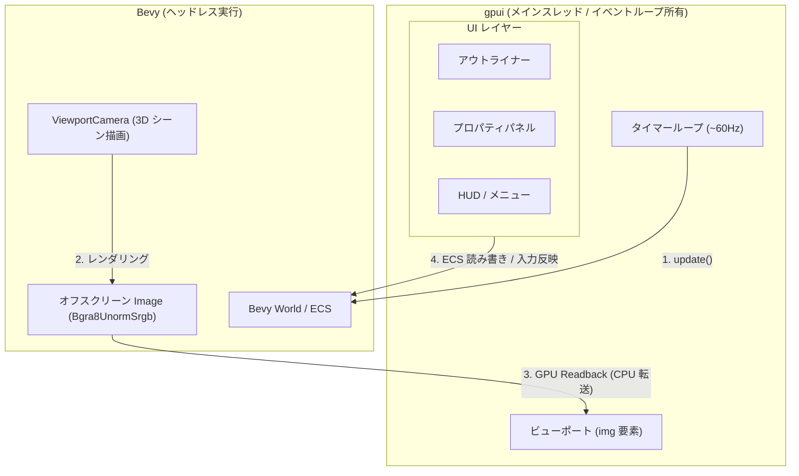
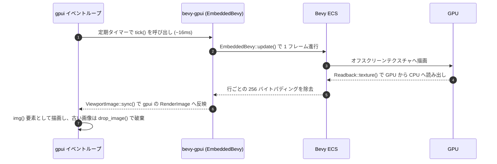

# bevy-gpui

Bevy 0.19 と gpui（Zed エディタ由来のネイティブ GUI フレームワーク）を同一プロセス内で統合する技術検証プロジェクトである。

Bevy が備える 3D レンダリングと ECS アーキテクチャに対し、gpui の洗練された UI コンポーネントおよび状態管理システムを組み合わせる構成の実現可能性、性能特性、適用領域を検証する。

## サンプル実行

ユースケースに応じた 2 種類のサンプルを用意している。

```bash
# サンプル 1: ゲーム UI（3D ゲーム上に gpui で HUD とポーズメニューを重畳）
cargo run --example game_ui

# サンプル 2: 3D エディタ（中央の 3D ビューポートを囲むアウトライナーとプロパティパネル）
cargo run --example editor
```

### 提供サンプル一覧

- `game_ui`
  - WASD キーによる移動とターゲット収集
  - Esc キーによるポーズメニューの開閉
  - gpui による HUD（スコアおよび FPS）のオーバーレイ表示
- `editor`
  - マウスドラッグによる 3D カメラ旋回（Orbit）とホイールによるズーム
  - アウトライナーパネルでのエンティティ一覧表示、選択、新規追加
  - プロパティパネルでの座標表示、マテリアル色変更、エンティティ削除
  - パネルの物理ピクセルサイズに追従するビューポートテクスチャの自動リサイズ

## アーキテクチャ

gpui がメインスレッド、OS ウィンドウ、イベントループを管理する。
Bevy はヘッドレスモードで起動し、オフスクリーンテクスチャへ描画したピクセルを CPU 経由で gpui へ転送する。



### レンダリングと転送シーケンス



### コアコンポーネント

- `EmbeddedBevy`
  - ウィンドウを持たない Bevy アプリケーションの管理構造体
  - `WindowPlugin` の初期ウィンドウ生成を抑制し、`WinitPlugin` と `PipelinedRenderingPlugin` を無効化
  - 同期的な `update()` 呼び出しにより、外部イベントループからの確実なフレーム進行を実現
- `ViewportCamera`
  - gpui ビューポートへ出力するカメラを指定するマーカーコンポーネント
  - 初期化時にオフスクリーンレンダーターゲットを自動割り当て
- `ViewportImage`
  - gpui 側の画像表示状態を保持するユーティリティ
  - CPU 側の BGRA フレームバッファを `gpui::RenderImage` へ変換
  - 不要になった過去フレームを gpui のスプライトアトラスから明示的に破棄

### 状態管理と入力連携

同一プロセス・同一メモリスレッド空間で動作するため、Bevy の `World` を介して双方向のデータ連携を行う。

- 入力イベントの転送
  - gpui のキーボード入力を Bevy の `ButtonInput<KeyCode>` リソースへ反映
  - gpui のマウスドラッグ量を Bevy のカメラ操作リソースへ直接適用
- ECS データの直接操作
  - アウトライナー描画時、Bevy の `World` をクエリしてエンティティ情報を直接取得
  - UI 操作によるパラメータ変更を対象コンポーネントへ即時反映

## 技術的評価と考察

「CPU メモリを経由したテクスチャ転送」に基づく本方式の特性は以下の通りである。

### 評価サマリー

| 評価項目 | 評価 | 特性 |
| --- | --- | --- |
| 動作安定性 | 高 | 公開 API のみで完結し、OS 固有のネイティブコードが不要 |
| 描画性能 | 中〜低 | GPU→CPU→GPU の往復コピーが発生（1080p/60fps で毎秒約 500MB の転送帯域を消費） |
| 表示遅延 | 許容範囲 | Readback の非同期完了待ちに伴い 1〜2 フレームの遅延が発生 |
| 入力統合作成コスト | 高 | マウス座標変換、カーソルロック、IME、ゲームパッドを個別実装する必要あり |
| 依存関係の保守性 | 低 | gpui の API 仕様変更が頻繁であり、git 参照が前提 |

### 適用領域の判断

- ゲーム向け UI（HUD / インゲームメニュー）
  - 結論: **非推奨**
  - gpui にイベントループを占有され、Bevy 本来の強み（winit 統合、ゲームパッド対応、モバイル/Web 展開）が損なわれる
  - ゲーム画面全域を毎フレーム CPU 転送するオーバーヘッドに対して得られるメリットが僅少
  - `bevy_ui` や `bevy_egui` による描画で十分代替可能
- デスクトップ 3D ツール（DCC、CAD、レベルエディタ）
  - 結論: **実用価値あり**
  - 大量のリスト、ツリー、複雑なパネル、キーバインドなど、業務アプリ規模の UI 開発において gpui の生産性が Bevy 標準 UI を凌駕する
  - 3D ビューポートが画面の一部に限定されるため、転送負荷を許容範囲に抑えやすい
  - Bevy の ECS をドキュメントモデルとして UI 側から直接読み書き可能

## 今後の拡張課題

本構成を実用レベルへ引き上げる場合の主な課題は以下の通りである。

- ゼロコピー転送の実現
  - CPU を介さず、GPU 共有テクスチャハンドルによる直接メモリ共有へ移行
  - macOS の `IOSurface`（gpui の `surface()` 要素）や Windows の DXGI 共有ハンドル等のプラットフォーム別実装が必要
- オンデマンド描画（ダーティレンダリング）
  - シーンやカメラの変更がないフレームでは Bevy の更新と転送をスキップ
  - アイドル時における CPU および GPU の不要な負荷を削減
- ビューポート操作イベントの統合
  - gpui のポインタイベントを Bevy のビューポート内ローカル座標へ変換
  - Bevy 側の Picking や Gizmo 操作とのシームレスな統合

## 依存関係に関する注意事項

- gpui のリビジョン固定
  - crates.io の公開版が古いため、Zed 公式リポジトリの特定コミットを参照
  - Zed の後続コミットに含まれるリンターテスト用クレート（同名 `gpui`）との名前衝突を避けるため、対象リビジョンを固定
- macOS でのシェーダーコンパイル
  - 完全版 Xcode（`metal` CLI）が未設定の環境でもビルドできるよう、`gpui_platform` の `runtime_shaders` フィーチャーを有効化
